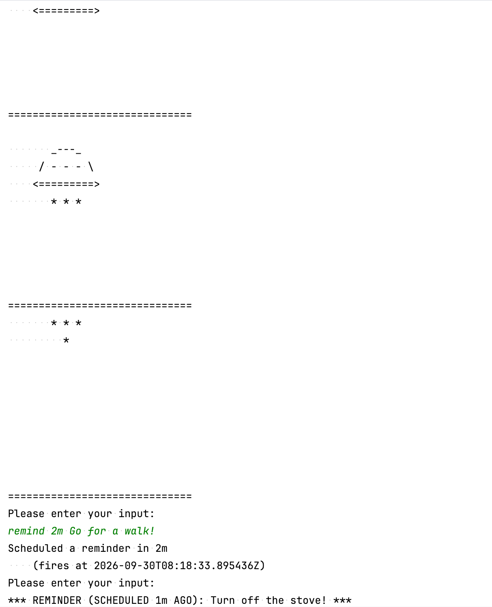

# Asynchronous control flow and suspending functions — Reminder application

This repository contains five versions of the reminder application used as a demonstration in [Asynchronous control flow and suspending functions](https://kotlinlang.org/docs/async-programming.html). Each version demonstrates a different approach to managing asynchronous control flow.

<p>
  
</p>

## Run an example

1. In your IDE, clone the project from a version control system:
   
   ```none
   https://github.com/kotlin-hands-on/suspending-functions-intro.git
   ```
   
2. In IntelliJ IDEA or Android Studio, open the example file you want to run, such as `src/main/kotlin/Example1.kt`. Click the **Run** icon next to its `main()` function.

You can also run an example from the repository root in a terminal. For example, to run `Example1.kt`, use:

```text
./gradlew runExample1
```

## Available commands

You can enter the following commands in the terminal while the application is running:

* `remind <duration> [message]` — Display a reminder after the specified duration, with a message. For example, `remind 10m Turn off stove!` or `remind 15s Do some stretching!`
* `fun_animation` — Play an animation.
* `help` — Show the available commands.
* `quit` — Exit the program.
